# Spooky Halloween
  

**Welcome to [Spooky Halloween](https://luinen.github.io/Halloweenquiz/)!**
  

Spooky Halloween is a Halloween-related quiz game. This small game gives you 5 minutes of fun for people who like exciting facts and want to learn something new. Here's an excellent chance to prove to your relatives that you are the smartest and luckiest family member.  The game is simple and enjoyable. Who will be the first on the leaderboard?

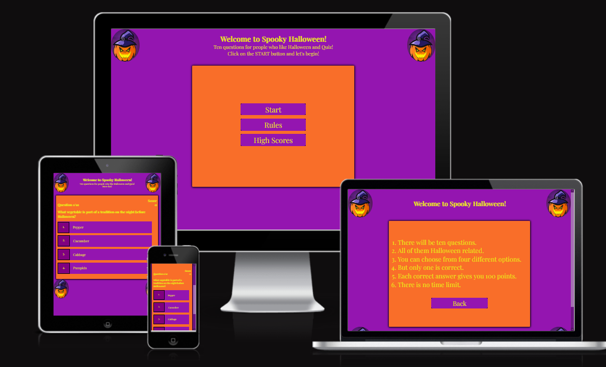

## Features

I explain the website features below.

### **Existing features**
  

- **Main menu**
  - A solid page with Halloween style, there are three options. If you click on the start button, the game will start. 
  - If the users want to know more about the instructions, they can click on the rules button. 
  - And finally, the users can see the leaderboard if they click the high scores button.
  - The active button appears with black border and purple box shadow , which highlights it from the background.

  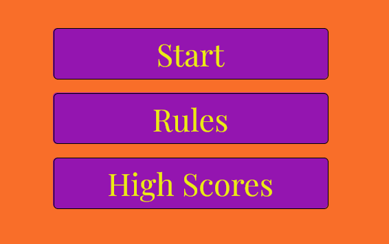
  
  

- **4 choices**
  - You can choose four different answers, and the active answer works the same as the main menu buttons.

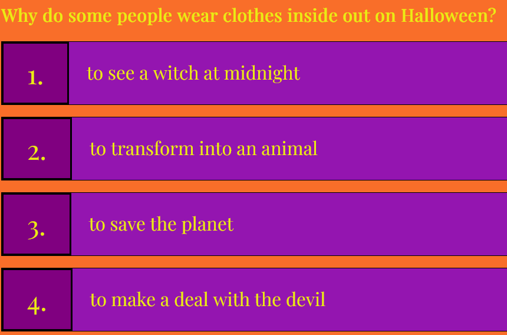

  - If you choose the good answer, the background of the answer will be green.
  
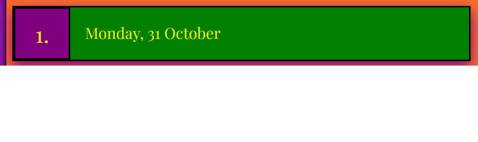

  - But if you choose the wrong answer, it will be red.

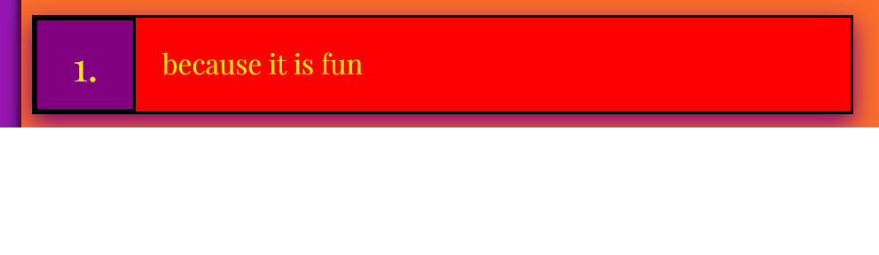

- **Score**
  - The user receives 100 points for each correct answer. Wrong answers don't give you points, and you can't get more than 1000 points.


- **Game Over page**
  - At the end of the quiz, the users can save their high score and enter their name, play again, or go back to the main menu. The form is easy to use and the placeholder helps the users.  

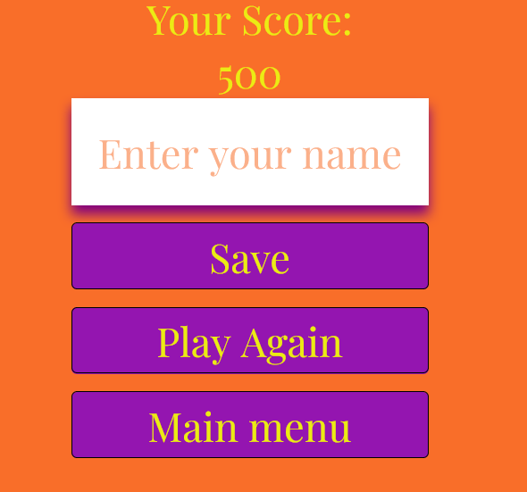

- **Leaderboard**
  - This part shows the saved usernames with their scores. The lowest points are at the bottom of the page, and the highest points are at the top.

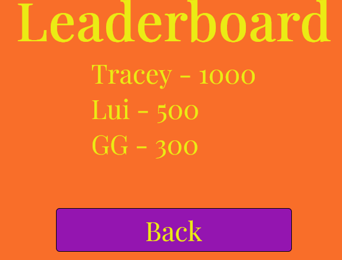

### **Features left to implement**
- I think a timer or a countdown would be a good idea to add to this quiz
- I want to add a progress bar next to the score

## Testing

  - The game works as intended. 
  - The scoring system is okay, it gives you 100 points for each correct answer. 
  - I tested each button and answers.
  - You have to fill out the username if you want to save your result. 
  - Responsiveness is good enough for every platform. 

#### **Lighthouse testing**

I used lighthouse to check the performance of my home page for mobile devices and desktop. The first time running the lighthouse, my SEO value was 80. After I added 'meta', the figures increased.
- Desktop version
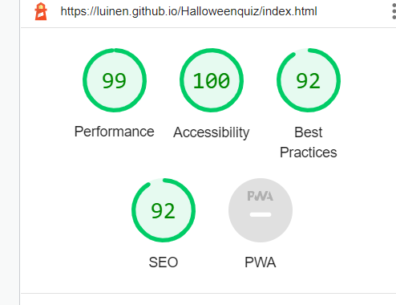
- Mobile version
 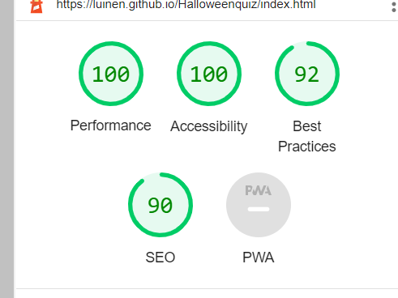

#### **Validator Testing**

- **HTML**
  - First time running the html validator I got 1 error, 1 info and 1 warning message: 

  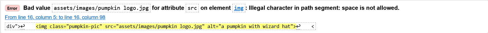
  - I renamed the image that fixed the issue.
  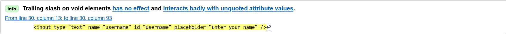
  - deleted the slash end of the input
  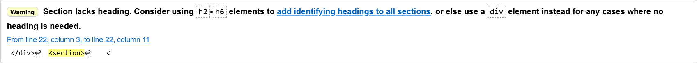
  - and deleted the section, because it was unnecessary.

  - After these mistakes were fixed, no errors were returned when passing through the official [W3c validator](https://validator.w3.org/)
- **CSS**

  - First time running the css validator I got 2 errors and 1 warning message: 

  - I deleted the space and I used quotes, and the problem solved.
    ```
    font-family:"Playfair Display", sans-serif;
    ```
    
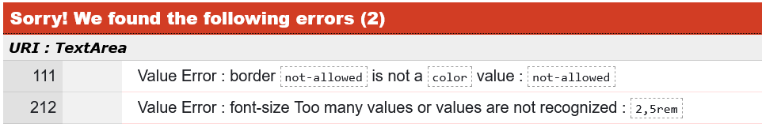
  - I changed 'not-allowed' to 'none' and I deleted the unnecessary font-size.

  - After these mistakes were fixed, no errors were returned when passing through the official [Jigsaw](https://jigsaw.w3.org/)


- **JS**
  - I tested my codes continuously with the JS validator during my work. I made many mistakes. For example, I often used the wrong keyword when I defined variables(let and const).
  - I forgot to call the function
  - missing or unnecessary semicolons
  - The quiz has 10 questions, but after a couple of questions the game froze. 
  ```
  questionIndex = Math.floor(Math.random() * 10
  ```
  - After i change the '10' to 'availableQuesions.length' it solved the problem

  ```
  questionIndex = Math.floor(Math.random() * availableQuesions.length
  ```


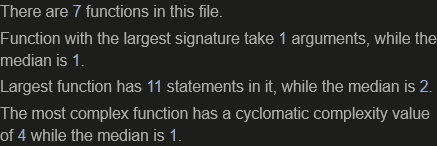
  - After these mistakes were fixed, no errors were returned when passing through the official [JS validator](https://jshint.com/)

#### 

## Deployment  

- The site was deployed to GitHub pages. The steps to deploy are as follows: 
  1. In the GitHub repository, navigate to the Settings tab.
  2. From the source section drop-down menu, select the Master Branch.
  3. Once the master branch has been selected, the page will be automatically refreshed with a detailed ribbon display to indicate the successful deployment.
  4. The live link can be found here: https://luinen.github.io/Halloweenquiz/

- If you want to clone the repository:
  1. In the GitHub repository, click on the 'Code'.
  2. Click 'Open with GitHub Desktop' to clone and open the repository with GitHub Desktop.
  3. Click 'Choose...' and, using the Finder window, navigate to a local path where you want to clone the repository. 
  4. Click Clone.  


## Credits

#### Content

- The questions for the quiz were taken from [Parade](https://parade.com/1066846/jessicasager/halloween-trivia/).
- Instructions of the container were taken from  [Web Dev Simplified](https://www.youtube.com/c/WebDevSimplified)
- The idea of the rules was taken from [CodingNepal](https://www.youtube.com/c/CodingNepal)
- Start the game and get new question function tutorial by [James Q Quick](https://www.youtube.com/c/JamesQQuick)
- Highscore function and local store save by [Brian Design](https://www.youtube.com/channel/UCsKsymTY_4BYR-wytLjex7A) was great.

#### Media 

- The pumpkin image was taken from [Dribble](https://dribbble.com/). 
